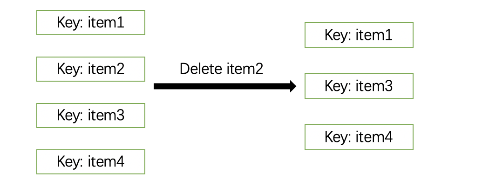
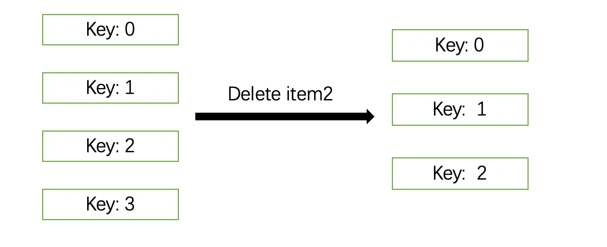
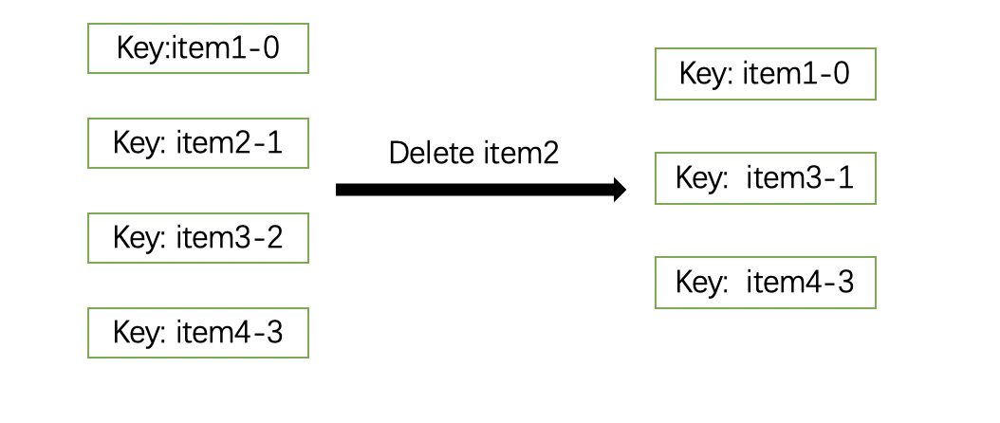

# transition-group-key
关于使用`vue transition-group`绑定key值的小问题

## demo
demo 可见[https://transition-group-key.logiczc.now.sh](https://transition-group-key.logiczc.now.sh)

## Why
网站存在三种方案，分别是:
1. 使用唯一的标识符表示，这里使用数组元素
2. 使用数组的index绑定
3. 使用数组的元素和index混合绑定

### for-1:
删除第二个元素，数组变为[item1, item2, item4]，此时key绑定的是item，初始key排列为(item1, item2, item3, item4)，后续变为(item1, item3, item4)，key只是第二个改变，因此动画作用于第二个元素

### for-2
删除第二个元素，数组变为[item1, item2, item4]，此时key绑定的是index，
初始key排列为(0, 1, 2, 3)，后续变为(0, 1, 2)，key只是最后一个改变，因此
动画作用于最后

### for-3
删除第二个元素，数组变为[item1, item2, item4]，此时key绑定的是item-index，初始
key排列为(item1-0, item2-1, item3-2, item4-3)，后续变为(item1-0, item3-1, item4-2)，
key从第二个开始全部改变，因此动画作用于第二个以及后续元素

